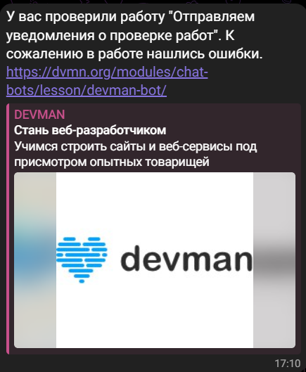

# Work inspection notices
 Скрипт проверяет статус работы на сервере `dewman.org`. В случае, если работа проверена, отправляет уведомление в 
 telegram. Если работ после проверки нет, то скрипт будет продолжать слать запросы на сервер, пока не получит ответ
 о проверке.

 Пример отправленного сообщения в telegram:

 
 
## Запуск скрипта
Для запуска необходимо скачать репозиторий
```
git clone https://github.com/Aleksashka301/upload_photo_to_telegram
```
Установить виртуальное окружение
```
python -m venv venv
```
Активировать виртуальное окружение
```
venv\Scripts\activate
```
Установить зависимости
```
pip install -r requirements.txt
```
В корневой папке создать файл `.env` для переменных окружения и добавить туда следующие переменные
1. `DEWMAN_TOKEN` - токен для работы с api dewman
2. `TELEGRAM_TOKEN` - токен телеграм бота. Выдаётся при регистрации бота. Если имеется зарегистрированный бот, то 
можно узнать его токен у `@BotFather`
3. `CHAT_ID` - id чата. Можно узнать его в телеграме через `@userinfobot`

После можно запускать скрипт командой
```python
python main.py
```
